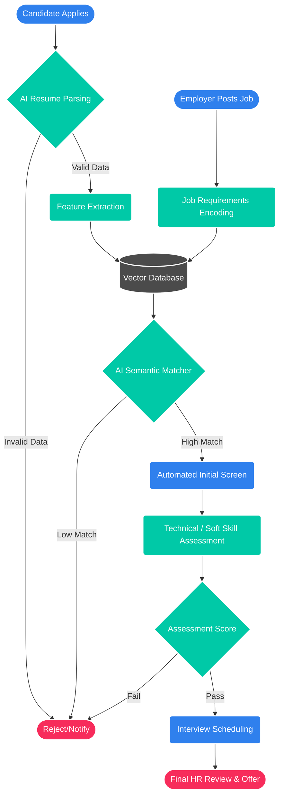

<div align="center">
  

  <a href="https://git.io/typing-svg"></a>

  <p align="center">
    <b>A next-generation AI-driven recruitment platform that connects top talent with outstanding opportunities.</b>
  </p>

  <div>
    
    
    
    
  </div>
</div>

---

## 🚀 Animated Workflow Overview

<div align="center">
  
  <p><i>HirePath automates the entire recruitment funnel—from candidate sourcing to interview scheduling, completely powered by intelligent insights.</i></p>
</div>

---

## 📊 Detailed System Flowchart

Here is the intricate, end-to-end architecture of how HirePath processes a candidate's journey.



---

## 🌟 Key Features

<table align="center" style="border: none;">
  <tr style="border: none;">
    <td width="50%" style="border: none;">
      <h3>🧠 AI Resume Parsing</h3>
      <ul>
        <li>Extracts skills, experience, and education with 99% accuracy.</li>
        <li>Eliminates human bias in early screening.</li>
        <li>Supports PDF, DOCX, and plain text formats.</li>
      </ul>
    </td>
    <td align="center" width="50%" style="border: none;">
      
    </td>
  </tr>
  <tr style="border: none;">
    <td align="center" width="50%" style="border: none;">
      
    </td>
    <td width="50%" style="border: none;">
      <h3>⚡ Seamless Interview Scheduling</h3>
      <ul>
        <li>Calendar syncing (Google, Outlook).</li>
        <li>Automated reminders for candidates & interviewers.</li>
        <li>Real-time availability adjustments.</li>
      </ul>
    </td>
  </tr>
</table>

## 🛠️ Quick Start

```bash
# 1. Clone the repository
git clone https://github.com/kanglesoham11-code/hirepath.git

# 2. Navigate to the project directory
cd hirepath

# 3. Install dependencies
npm install

# 4. Setup environment variables
cp .env.example .env

# 5. Run the development server
npm run dev
```

## 🤝 Contributing

We welcome contributions! Please open an issue or submit a pull request if you have ideas for improvements.

## 📜 License

Distributed under the MIT License. See `LICENSE` for more information.

---

<div align="center">
  <p>Made with ❤️ by <a href="https://github.com/kanglesoham11-code">Soham</a></p>
  
</div>
